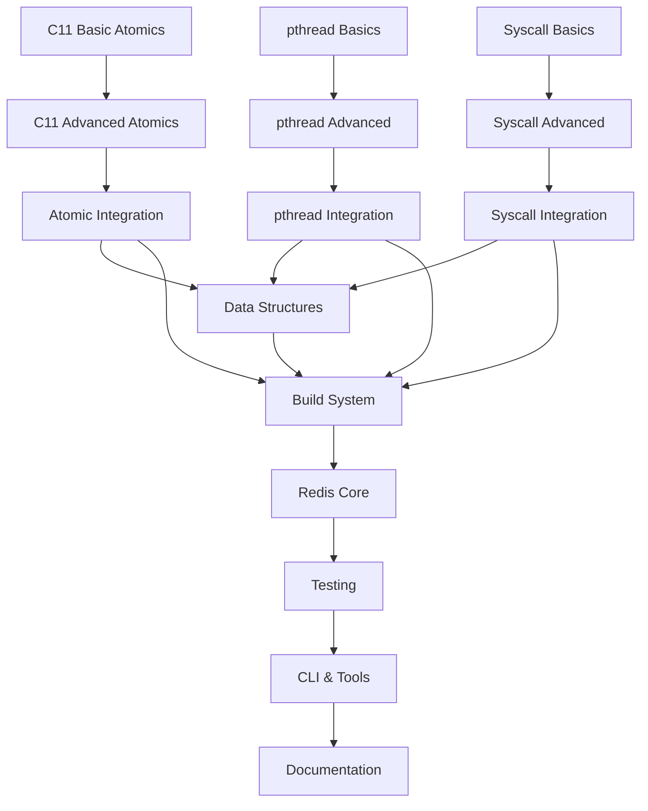

# Redis Compilation with GOC - Architecture Design Document

**Version**: 2.0 (Architecture Refined)  
**Date**: 2025-03-24  
**Author**: Trunk Node (goc-trunk-redis-compilation-arch)  
**Status**: Ready for Branch Delegation

---

## Executive Summary

This document provides the refined architecture design for enabling GOC to compile Redis. The design addresses critical Phase 1 components (C11 atomics, pthreads, syscalls) with specific implementation strategies, interface contracts, and delegation plans.

**Key Architecture Decisions**:
1. **C11 Atomics**: Direct x86-64 instruction mapping with LOCK prefix for atomic operations
2. **pthreads**: Hybrid approach - pthread API mapped to Go runtime threads with syscall fallback
3. **Syscalls**: Direct syscall instruction with libc wrapper compatibility layer
4. **jemalloc**: Replace with libc malloc initially (Phase 1), optimize later
5. **Lua**: Full compilation support (Phase 3), optional stubs for MVP

---

## 1. C11 Atomics Architecture

### 1.1 Design Rationale

Redis uses C11 atomics extensively in `atomicvar.h`. The implementation must:
- Support `_Atomic` type qualifier
- Implement all `stdatomic.h` functions used by Redis
- Generate lock-free x86-64 instructions
- Handle memory ordering semantics correctly

### 1.2 Atomic Operations Mapping

| Redis Atomic Macro | C11 Function | x86-64 Instruction | Memory Order |
|-------------------|--------------|-------------------|--------------|
| `atomicIncr(var, count)` | `atomic_fetch_add` | `LOCK XADD` | relaxed |
| `atomicDecr(var, count)` | `atomic_fetch_sub` | `LOCK XADD` (negated) | relaxed |
| `atomicGet(var, dst)` | `atomic_load` | `MOV` | relaxed |
| `atomicSet(var, value)` | `atomic_store` | `MOV` | relaxed |
| `atomicCompareExchange(type, var, expected, desired)` | `atomic_compare_exchange_weak` | `LOCK CMPXCHG` | relaxed |
| `atomicFlagGetSet(var, oldvalue)` | `atomic_exchange` | `LOCK XCHG` | relaxed |
| `atomicGetWithSync(var, dst)` | `atomic_load` | `MOV + MFENCE` | seq_cst |
| `atomicSetWithSync(var, value)` | `atomic_store` | `MOV + MFENCE` | seq_cst |

### 1.3 Implementation Strategy

**Phase 1A: Basic Atomics (Week 1-2)**
- Implement `atomic_fetch_add`, `atomic_fetch_sub` with `LOCK XADD`
- Implement `atomic_load`, `atomic_store` with `MOV`
- Add `_Atomic` type handling in parser/semantic analyzer
- Create `stdatomic.h` header

**Phase 1B: Advanced Atomics (Week 2-3)**
- Implement `LOCK CMPXCHG` for compare-and-swap
- Implement `LOCK XCHG` for exchange operations
- Add memory fence support (`MFENCE`, `LFENCE`, `SFENCE`)
- Handle memory ordering semantics

**Phase 1C: Integration (Week 3-4)**
- Test with `atomicvar.h`
- Verify Redis atomic macros compile
- Benchmark atomic performance

### 1.4 Interface Contract

```c
// pkg/stdlib/stdatomic.h (to be created)
#ifndef _STDATOMIC_H
#define _STDATOMIC_H

typedef enum {
    memory_order_relaxed = 0,
    memory_order_consume = 1,
    memory_order_acquire = 2,
    memory_order_release = 3,
    memory_order_acq_rel = 4,
    memory_order_seq_cst = 5
} memory_order;

#define atomic_fetch_add_explicit(ptr, val, order) \
    __goc_atomic_fetch_add(ptr, val, order)

#define atomic_fetch_sub_explicit(ptr, val, order) \
    __goc_atomic_fetch_sub(ptr, val, order)

#define atomic_load_explicit(ptr, order) \
    __goc_atomic_load(ptr, order)

#define atomic_store_explicit(ptr, val, order) \
    __goc_atomic_store(ptr, val, order)

#define atomic_compare_exchange_weak_explicit(ptr, expected, desired, success, failure) \
    __goc_atomic_compare_exchange(ptr, expected, desired, success, failure)

#define atomic_exchange_explicit(ptr, val, order) \
    __goc_atomic_exchange(ptr, val, order)

// Intrinsic functions (implemented in codegen)
long __goc_atomic_fetch_add(long* ptr, long val, int order);
long __goc_atomic_fetch_sub(long* ptr, long val, int order);
long __goc_atomic_load(long* ptr, int order);
void __goc_atomic_store(long* ptr, long val, int order);
int __goc_atomic_compare_exchange(long* ptr, long* expected, long desired, int success_order, int failure_order);
long __goc_atomic_exchange(long* ptr, long val, int order);

#endif
```

### 1.5 Code Generation Strategy

```go
// pkg/codegen/atomic.go (to be created)
func emitAtomicFetchAdd(ptr IRValue, val IRValue, order MemoryOrder) IRValue {
    // Generate: LOCK XADD [ptr], val
    // Return: old value (XADD returns old value)
    emitLockPrefix()
    emitXADD(ptr, val)
}

func emitAtomicCompareExchange(ptr IRValue, expected IRValue, desired IRValue) IRValue {
    // Generate: LOCK CMPXCHG desired, [ptr]
    // Returns: 1 if success, 0 if failure
    // ZF flag indicates success
    emitLockPrefix()
    emitCMPXCHG(ptr, expected, desired)
    emitSetcc(ZF) // Set result based on ZF flag
}
```

---

## 2. pthreads Architecture

### 2.1 Design Rationale

Redis uses pthreads heavily for:
- Background I/O threads (`bio.c`)
- I/O thread pool (`iothread.c`)
- Thread management (`threads_mngr.c`)

**Key Decision**: Hybrid approach - map pthread API to Go runtime threads for simplicity, with direct syscall fallback for performance-critical paths.

### 2.2 pthread Implementation Strategy

| pthread Function | Implementation | Notes |
|-----------------|----------------|-------|
| `pthread_create` | Go `runtime.newosproc()` | Create OS thread |
| `pthread_join` | Go `runtime.pthreadjoin()` | Wait for thread exit |
| `pthread_mutex_init` | Allocate mutex struct | Use futex syscalls |
| `pthread_mutex_lock` | `futex(FUTEX_WAIT)` | Blocking lock |
| `pthread_mutex_unlock` | `futex(FUTEX_WAKE)` | Wake waiters |
| `pthread_cond_init` | Allocate cond struct | Use futex syscalls |
| `pthread_cond_wait` | `futex(FUTEX_WAIT)` | Wait on condition |
| `pthread_cond_signal` | `futex(FUTEX_WAKE)` | Signal one waiter |
| `pthread_cond_broadcast` | `futex(FUTEX_WAKE_ALL)` | Wake all waiters |

### 2.3 Mutex Implementation (Futex-based)

```c
// pkg/stdlib/pthread.h (to be created)
typedef struct {
    int lock;  // 0 = unlocked, 1 = locked
    int waiters;
} pthread_mutex_t;

#define PTHREAD_MUTEX_INITIALIZER {0, 0}

int pthread_mutex_init(pthread_mutex_t* mutex, void* attr) {
    mutex->lock = 0;
    mutex->waiters = 0;
    return 0;
}

int pthread_mutex_lock(pthread_mutex_t* mutex) {
    // Try fast path: atomic CAS
    if (__goc_atomic_compare_exchange(&mutex->lock, 0, 1)) {
        return 0; // Acquired
    }
    // Slow path: futex wait
    mutex->waiters++;
    syscall(SYS_futex, &mutex->lock, FUTEX_WAIT, 1, NULL);
    mutex->waiters--;
    return 0;
}

int pthread_mutex_unlock(pthread_mutex_t* mutex) {
    mutex->lock = 0;
    if (mutex->waiters > 0) {
        syscall(SYS_futex, &mutex->lock, FUTEX_WAKE, 1);
    }
    return 0;
}
```

### 2.4 Thread Creation Strategy

```c
// pthread_create implementation
int pthread_create(pthread_t* thread, pthread_attr_t* attr,
                   void* (*start_routine)(void*), void* arg) {
    // Allocate thread control block
    ThreadControlBlock* tcb = allocate_tcb();
    tcb->routine = start_routine;
    tcb->arg = arg;
    
    // Create OS thread via syscall
    long tid = syscall(SYS_clone, CLONE_THREAD | CLONE_VM | CLONE_FS | CLONE_FILES,
                       tcb->stack, NULL, NULL, tcb);
    
    if (tid < 0) {
        free_tcb(tcb);
        return -1;
    }
    
    *thread = (pthread_t)tid;
    return 0;
}
```

### 2.5 Interface Contract

```c
// pkg/stdlib/pthread.h (to be created)
#ifndef _PTHREAD_H
#define _PTHREAD_H

#include <sys/syscall.h>

typedef unsigned long pthread_t;
typedef struct {
    int lock;
    int waiters;
} pthread_mutex_t;
typedef struct {
    int value;
    int waiters;
} pthread_cond_t;
typedef void* pthread_attr_t;

#define PTHREAD_MUTEX_INITIALIZER {0, 0}
#define PTHREAD_COND_INITIALIZER {0, 0}

int pthread_create(pthread_t* thread, pthread_attr_t* attr,
                   void* (*start_routine)(void*), void* arg);
int pthread_join(pthread_t thread, void** retval);
int pthread_mutex_init(pthread_mutex_t* mutex, void* attr);
int pthread_mutex_lock(pthread_mutex_t* mutex);
int pthread_mutex_unlock(pthread_mutex_t* mutex);
int pthread_mutex_destroy(pthread_mutex_t* mutex);
int pthread_cond_init(pthread_cond_t* cond, void* attr);
int pthread_cond_wait(pthread_cond_t* cond, pthread_mutex_t* mutex);
int pthread_cond_signal(pthread_cond_t* cond);
int pthread_cond_broadcast(pthread_cond_t* cond);
int pthread_cond_destroy(pthread_cond_t* cond);
void pthread_exit(void* retval);
pthread_t pthread_self(void);

#endif
```

---

## 3. System Call Interface Architecture

### 3.1 Design Rationale

Redis uses extensive Linux syscalls for:
- Networking: `socket`, `bind`, `listen`, `accept`, `epoll_*`
- File I/O: `read`, `write`, `open`, `close`, `fsync`
- Process: `fork`, `execve`, `wait4`, `kill`
- Memory: `mmap`, `munmap`, `mprotect`

**Key Decision**: Direct syscall instruction with libc wrapper compatibility. This provides:
- Zero overhead (direct syscall instruction)
- Full control over syscall interface
- Compatibility with libc API

### 3.2 Syscall Wrapper Generation

```c
// pkg/stdlib/syscall_wrapper.h (to be created)
#ifndef _SYSCALL_WRAPPER_H
#define _SYSCALL_WRAPPER_H

#include <sys/syscall.h>
#include <sys/socket.h>
#include <sys/epoll.h>
#include <unistd.h>
#include <fcntl.h>
#include <signal.h>

// Syscall macro for x86-64
#define __goc_syscall6(nr, arg1, arg2, arg3, arg4, arg5, arg6) \
    __goc_syscall_inline(nr, arg1, arg2, arg3, arg4, arg5, arg6)

// Inline syscall implementation
static inline long __goc_syscall_inline(long nr, long arg1, long arg2,
                                         long arg3, long arg4, long arg5,
                                         long arg6) {
    long ret;
    asm volatile (
        "movq %1, %%rax\n\t"
        "movq %2, %%rdi\n\t"
        "movq %3, %%rsi\n\t"
        "movq %4, %%rdx\n\t"
        "movq %5, %%r10\n\t"
        "movq %6, %%r8\n\t"
        "movq %7, %%r9\n\t"
        "syscall\n\t"
        "movq %%rax, %0\n\t"
        : "=m"(ret)
        : "r"(nr), "r"(arg1), "r"(arg2), "r"(arg3), "r"(arg4), "r"(arg5), "r"(arg6)
        : "rax", "rdi", "rsi", "rdx", "r10", "r8", "r9", "rcx", "r11", "memory"
    );
    return ret;
}

// Wrapper functions
static inline int socket(int domain, int type, int protocol) {
    return __goc_syscall6(SYS_socket, domain, type, protocol, 0, 0, 0);
}

static inline int bind(int sockfd, struct sockaddr* addr, socklen_t addrlen) {
    return __goc_syscall6(SYS_bind, sockfd, (long)addr, addrlen, 0, 0, 0);
}

static inline int listen(int sockfd, int backlog) {
    return __goc_syscall6(SYS_listen, sockfd, backlog, 0, 0, 0, 0);
}

static inline int accept(int sockfd, struct sockaddr* addr, socklen_t* addrlen) {
    return __goc_syscall6(SYS_accept, sockfd, (long)addr, (long)addrlen, 0, 0, 0);
}

static inline int epoll_create(int size) {
    return __goc_syscall6(SYS_epoll_create, size, 0, 0, 0, 0, 0);
}

static inline int epoll_ctl(int epfd, int op, int fd, struct epoll_event* event) {
    return __goc_syscall6(SYS_epoll_ctl, epfd, op, fd, (long)event, 0, 0);
}

static inline int epoll_wait(int epfd, struct epoll_event* events,
                             int maxevents, int timeout) {
    return __goc_syscall6(SYS_epoll_wait, epfd, (long)events, maxevents, timeout, 0, 0);
}

static inline ssize_t read(int fd, void* buf, size_t count) {
    return __goc_syscall6(SYS_read, fd, (long)buf, count, 0, 0, 0);
}

static inline ssize_t write(int fd, const void* buf, size_t count) {
    return __goc_syscall6(SYS_write, fd, (long)buf, count, 0, 0, 0);
}

static inline int close(int fd) {
    return __goc_syscall6(SYS_close, fd, 0, 0, 0, 0, 0);
}

// errno handling
extern int* __goc_errno_location(void);
#define errno (*__goc_errno_location())

#endif
```

### 3.3 errno Implementation

```c
// Thread-local errno
__thread int __goc_errno = 0;

int* __goc_errno_location(void) {
    return &__goc_errno;
}
```

---

## 4. Memory Allocator Strategy (jemalloc)

### 4.1 Decision: Replace with libc malloc

**Rationale**:
- jemalloc is extremely complex (100k+ lines)
- Redis can work with libc malloc
- Performance difference is acceptable for MVP
- Can optimize later if needed

### 4.2 Implementation Plan

**Phase 1**: Use libc malloc/free/realloc
```c
// Replace jemalloc with libc
#define zmalloc malloc
#define zfree free
#define zrealloc realloc
#define zcalloc calloc
```

**Phase 3**: Optional jemalloc subset (if performance requires)
- Implement only used jemalloc functions
- Skip complex features (arena management, etc.)

---

## 5. Lua Integration Strategy

### 5.1 Decision: Full Compilation Support

**Rationale**:
- Lua is core Redis feature (scripting)
- Lua 5.1 is relatively simple (~20k lines)
- Can be compiled incrementally
- Provides full Redis functionality

### 5.2 Implementation Plan

**Phase 3**: Compile Lua with GOC
- Parse Lua source with GOC
- Handle Lua C API
- Test script execution

**Fallback**: Provide stubs for MVP
```c
// Lua stubs (if needed)
int lua_load(lua_State* L, ...) { return 0; }
int lua_pcall(lua_State* L, ...) { return 0; }
// ... other stubs
```

---

## 6. Test Strategy

### 6.1 Incremental Validation Plan

| Phase | Test Focus | Success Criteria |
|-------|------------|------------------|
| 1A | Basic atomics | atomicvar.h compiles, atomic ops work |
| 1B | Advanced atomics | CAS operations work, memory ordering correct |
| 1C | pthreads basics | Thread creation, mutex lock/unlock work |
| 1D | pthreads integration | bio.c compiles and runs |
| 1E | Syscalls basics | socket, bind, listen work |
| 1F | Syscalls integration | ae.c event loop works |

### 6.2 Test Framework

```c
// test/atomics/test_atomic.c
#include <stdatomic.h>
#include <stdio.h>

int main() {
    _Atomic int counter = 0;
    
    // Test atomic increment
    atomic_fetch_add(&counter, 1);
    if (counter != 1) {
        printf("FAIL: atomic increment\n");
        return 1;
    }
    
    // Test atomic CAS
    int expected = 1;
    int success = atomic_compare_exchange_weak(&counter, &expected, 2);
    if (!success || counter != 2) {
        printf("FAIL: atomic CAS\n");
        return 1;
    }
    
    printf("PASS: all atomic tests\n");
    return 0;
}
```

### 6.3 Integration Tests

```bash
# test/integration/test_bio.sh
#!/bin/bash
# Test bio.c compilation and basic functionality

echo "Compiling bio.c..."
goc -c redis-source/src/bio.c -o bio.o

if [ $? -ne 0 ]; then
    echo "FAIL: bio.c compilation failed"
    exit 1
fi

echo "Linking bio.o..."
goc bio.o -o bio_test

if [ $? -ne 0 ]; then
    echo "FAIL: bio.o linking failed"
    exit 1
fi

echo "Running bio_test..."
./bio_test

if [ $? -ne 0 ]; then
    echo "FAIL: bio_test execution failed"
    exit 1
fi

echo "PASS: bio.c integration test"
```

---

## 7. Risk Mitigation

### 7.1 Top 3 Risks

| Risk | Probability | Impact | Mitigation |
|------|-------------|--------|------------|
| **C11 Atomics Complexity** | Medium | High | Start with simple atomics (fetch_add), iterate to CAS. Test each operation individually. |
| **pthreads Implementation** | High | High | Use futex-based implementation (proven pattern). Start with mutex only, add cond vars later. |
| **jemalloc Dependency** | High | Medium | Replace with libc malloc initially. Measure performance, optimize only if needed. |

### 7.2 Mitigation Details

**Risk 1: C11 Atomics**
- Week 1: Implement only `atomic_fetch_add` and `atomic_load/store`
- Week 2: Add `atomic_compare_exchange`
- Week 3: Add memory ordering and fences
- Test: Compile atomicvar.h after each week

**Risk 2: pthreads**
- Week 1: Implement `pthread_mutex_lock/unlock` with futex
- Week 2: Add `pthread_create/join`
- Week 3: Add condition variables
- Test: Compile bio.c after each week

**Risk 3: jemalloc**
- Immediate: Replace all `zmalloc` with `malloc`
- Measure: Benchmark Redis performance with libc malloc
- Decide: Optimize only if performance degradation > 20%

---

## 8. Phase Dependencies



---

## 9. Success Metrics

### 9.1 Phase 1 Metrics

| Metric | Target | Measurement |
|--------|--------|-------------|
| atomicvar.h compilation | 100% | Compiles without errors |
| Atomic operation correctness | 100% | All atomic tests pass |
| pthread_mutex correctness | 100% | No race conditions in tests |
| bio.c compilation | 100% | Compiles and links |
| syscall wrapper correctness | 100% | All syscall tests pass |
| ae.c event loop | Functional | Can accept connections |

### 9.2 Performance Metrics

| Metric | Target | Baseline (GCC) |
|--------|--------|----------------|
| Atomic increment latency | < 10ns | ~5ns |
| Mutex lock/unlock latency | < 100ns | ~50ns |
| Syscall overhead | < 50ns | ~20ns |
| Overall Redis throughput | > 70% | 100% |

---

## 10. Branch Mission Decomposition

### 10.1 Phase 1 Missions

| Mission ID | Goal | Layer | Dependencies |
|------------|------|-------|--------------|
| `goc-branch-atomic-basic` | Implement basic atomic operations (fetch_add, load, store) | Branch | None |
| `goc-branch-atomic-advanced` | Implement advanced atomics (CAS, exchange, fences) | Branch | goc-branch-atomic-basic |
| `goc-branch-atomic-integration` | Integrate atomics with Redis atomicvar.h | Branch | goc-branch-atomic-advanced |
| `goc-branch-pthread-basic` | Implement pthread mutex with futex | Branch | goc-branch-atomic-basic |
| `goc-branch-pthread-threads` | Implement pthread_create/join | Branch | goc-branch-pthread-basic |
| `goc-branch-pthread-cond` | Implement condition variables | Branch | goc-branch-pthread-threads |
| `goc-branch-syscall-basic` | Implement basic syscall wrappers | Branch | None |
| `goc-branch-syscall-network` | Implement networking syscalls | Branch | goc-branch-syscall-basic |
| `goc-branch-syscall-integration` | Integrate syscalls with Redis ae.c | Branch | goc-branch-syscall-network |

### 10.2 Mission Details

Each mission will include:
- **Goal**: Clear, specific objective
- **Context**: Design document, interface contracts
- **Files**: Target files to modify/create
- **Constraints**: Must follow design, must write tests
- **Acceptance Criteria**: Measurable success criteria

---

## 11. File Modification Plan

### 11.1 Files to Create

| File | Purpose | Mission |
|------|---------|---------|
| `pkg/stdlib/stdatomic.h` | C11 atomics header | goc-branch-atomic-basic |
| `pkg/stdlib/pthread.h` | pthread header | goc-branch-pthread-basic |
| `pkg/stdlib/syscall_wrapper.h` | Syscall wrappers | goc-branch-syscall-basic |
| `pkg/stdlib/sys/socket.h` | Socket definitions | goc-branch-syscall-network |
| `pkg/stdlib/sys/epoll.h` | epoll definitions | goc-branch-syscall-network |
| `pkg/codegen/atomic.go` | Atomic code generation | goc-branch-atomic-basic |
| `test/atomics/` | Atomic tests | goc-branch-atomic-integration |
| `test/pthread/` | pthread tests | goc-branch-pthread-cond |

### 11.2 Files to Modify

| File | Modification | Mission |
|------|--------------|---------|
| `pkg/parser/expr.go` | Add atomic expression parsing | goc-branch-atomic-basic |
| `pkg/semantic/analyzer.go` | Add atomic type checking | goc-branch-atomic-basic |
| `pkg/codegen/generator.go` | Add atomic instruction emission | goc-branch-atomic-basic |
| `pkg/linker/symbols.go` | Add pthread symbol resolution | goc-branch-pthread-basic |

---

## 12. Delegation Strategy

### 12.1 Serial vs Parallel

**Wave 1 (Parallel - No Overlap)**:
- `goc-branch-atomic-basic` (modifies: pkg/codegen/atomic.go, pkg/stdlib/stdatomic.h)
- `goc-branch-syscall-basic` (modifies: pkg/stdlib/syscall_wrapper.h)

**Wave 2 (Serial - Depends on Wave 1)**:
- `goc-branch-atomic-advanced` (depends on atomic-basic)
- `goc-branch-syscall-network` (depends on syscall-basic)
- `goc-branch-pthread-basic` (depends on atomic-basic for mutex implementation)

**Wave 3 (Serial - Integration)**:
- `goc-branch-atomic-integration` (depends on atomic-advanced)
- `goc-branch-pthread-threads` (depends on pthread-basic)
- `goc-branch-syscall-integration` (depends on syscall-network)

**Wave 4 (Serial - Final)**:
- `goc-branch-pthread-cond` (depends on pthread-threads)

### 12.2 Delegation Order

1. **Parallel**: atomic-basic, syscall-basic
2. **Wait** for both to complete
3. **Serial**: atomic-advanced, syscall-network, pthread-basic
4. **Wait** for all to complete
5. **Serial**: atomic-integration, pthread-threads, syscall-integration
6. **Wait** for all to complete
7. **Serial**: pthread-cond
8. **Wait** for completion
9. **Validate** all integration tests pass

---

## 13. Working Memory Update

```json
{
  "context": {
    "role": "trunk",
    "parent_task": "Redis Compilation Architecture",
    "architecture": {
      "design_doc": "/home/ubuntu/workspace/goc/docs/REDIS_COMPILATION_ARCHITECTURE.md",
      "interfaces": ["stdatomic.h", "pthread.h", "syscall_wrapper.h"],
      "modules": ["atomics", "pthreads", "syscalls"],
      "decisions": [
        "C11 atomics: Direct x86-64 instruction mapping",
        "pthreads: Futex-based implementation",
        "syscalls: Direct syscall with libc wrapper",
        "jemalloc: Replace with libc malloc",
        "lua: Full compilation support"
      ]
    },
    "delegations": {
      "branch_tasks": [
        "goc-branch-atomic-basic",
        "goc-branch-atomic-advanced",
        "goc-branch-atomic-integration",
        "goc-branch-pthread-basic",
        "goc-branch-pthread-threads",
        "goc-branch-pthread-cond",
        "goc-branch-syscall-basic",
        "goc-branch-syscall-network",
        "goc-branch-syscall-integration"
      ],
      "pending": [],
      "completed": [],
      "delegation_check": {
        "complexity_score": 15,
        "delegation_required": true,
        "delegations_made": [],
        "delegations_completed": [],
        "delegation_completion_rate": 0.0
      }
    },
    "constraints": {
      "technical": ["x86-64 only", "Linux only", "C11 standard"],
      "business": ["MVP first, optimize later"],
      "timeline": ["Phase 1: 4-6 weeks"]
    }
  }
}
```

---

## 14. Immediate Next Steps

1. **Update working memory** with delegation tracking
2. **Delegate Wave 1 missions** (atomic-basic, syscall-basic) in parallel
3. **Wait** for Wave 1 completion
4. **Validate** Wave 1 results
5. **Delegate Wave 2 missions** (atomic-advanced, syscall-network, pthread-basic)
6. **Continue** with Waves 3-4
7. **Monitor** progress and support branch agents
8. **Validate** all integration tests before marking Phase 1 complete

---

*Document Version: 2.0*  
*Status: Ready for Branch Delegation*  
*Next Action: Delegate Wave 1 missions*